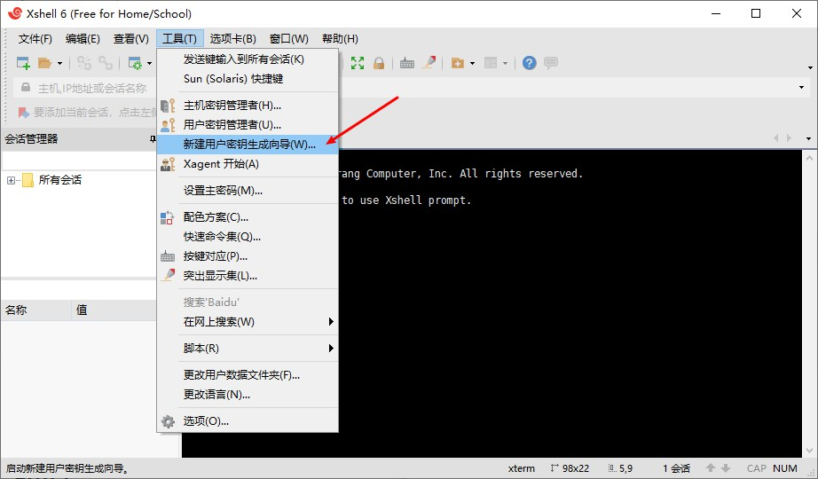
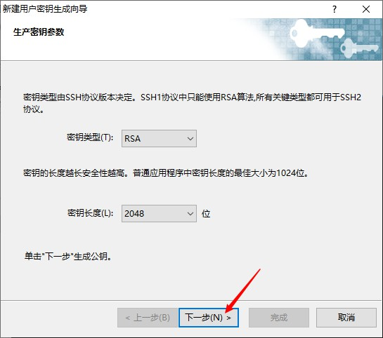
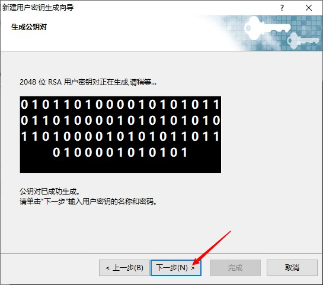
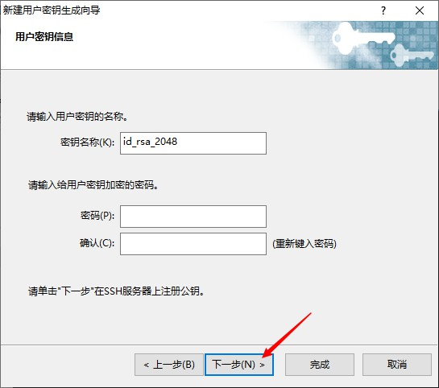
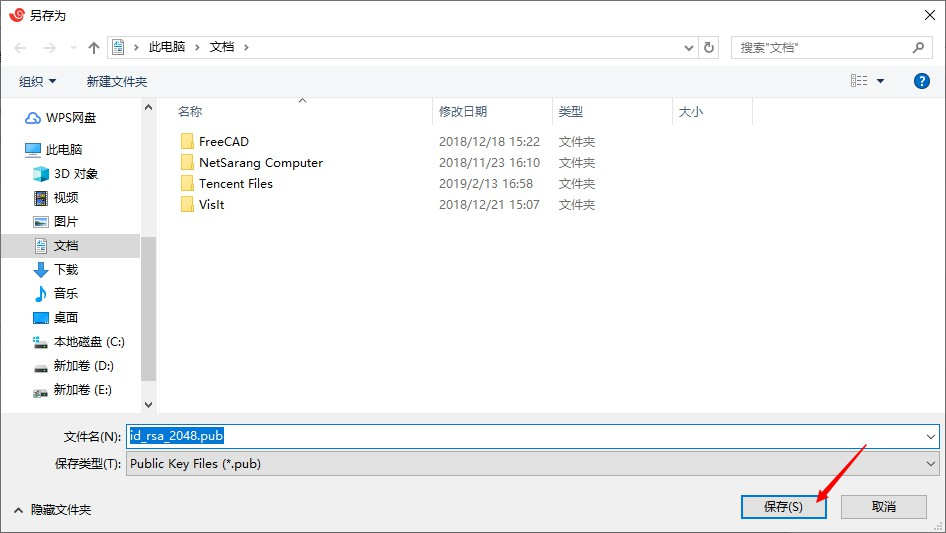
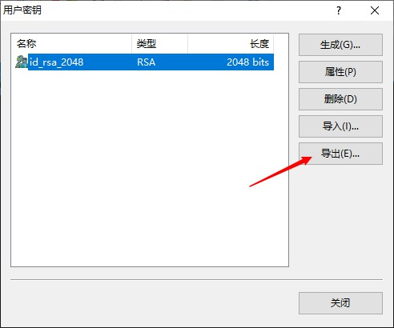
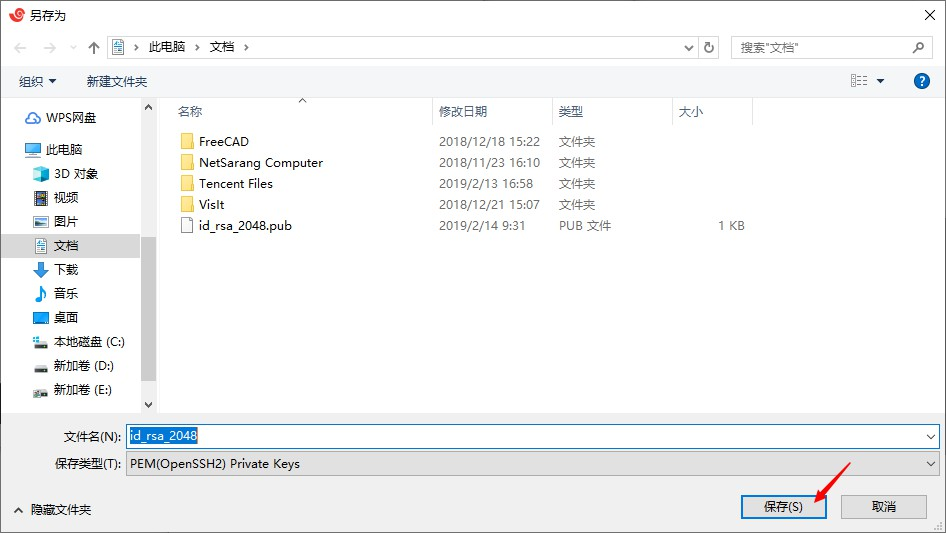

# ssh

> ssh是一种安全链接远程服务器的通讯协议

## ssh客户端

Win平台：

- Xshell

- PuTTY

Linux/Unix:

终端自带ssh命令

## ssh登陆

ssh登陆的两种方式

1. 通过密码登陆

```bash
ssh root@remote.com # 使用root账号登陆远程主机remote.com(可以是IP地址)

# 根据提示符输入密码即可登陆

# 也可以使用sshpass来指定密码登陆，但是没有实践成功
```

2. 通过产生ssh密钥对免密码登陆

linux下产生ssh密钥：

```bash
ssh-keygen -t rsa

# 不要输入密码
```

产生如下密钥对：

```bash
id_rsa # 私钥
id_rsa.pub # 公钥
```

windows下产生ssh密钥对：

由于没有ssh-keygen工具，可以通过xshell工具来产生。

以xshell6为例：
















至此得到两个文件:

id_ras_2048.pub(公钥)

id_ras_2048(私钥)

公钥放置在需登陆的远程主机上

```bash
# 在远程主机上执行
cat id_rsa.pub >> ~/.ssh/authorized_keys
```

或者

```bash
# 在本地主机上执行
ssh-copy-id -i /root/.ssh/id_rsa.pub root@remote.com
```

私钥放置在本机上

linux下:

直接ssh登陆

```bash
ssh root@remote.com
```

windows下:

xshell设置指定私钥文件即可登陆。

::: warning 注意事项

.ssh的目录权限 700

authorized_keys的权限 600

:::
